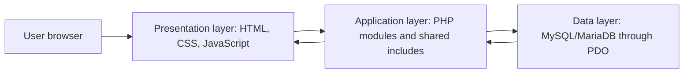
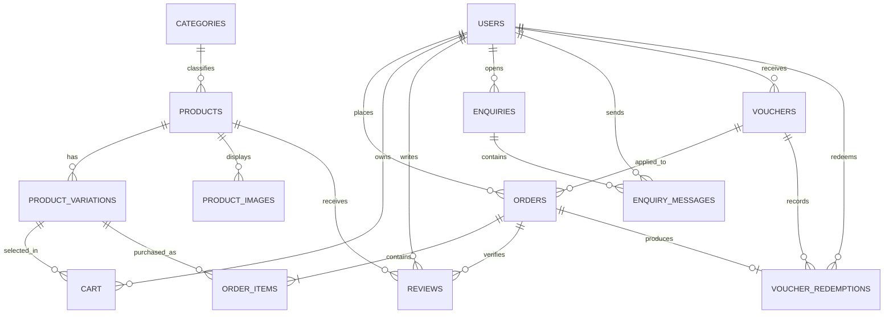

# CIT6224 Web Application Development

## Section B: System Development and Technical Report

**Project title:** HypeThread Online Fashion Store E-Commerce Web-Based System  
**Lecture session:** TC1L  
**Tutorial session:** TT1L  
**Group:** 11

| Group member | Student ID | Primary module |
|---|---:|---|
| Muhammad Aqil Bin Bachtiar Affendy | 1211104729 | Buyer Shopping Module |
| Lam Rong Yi | 1211107112 | Public and Admin Module |
| Sia Jing Liang | 1211106208 | Business Owner Module |
| Willie Teoh Chin Wei | 1211106712 | Product Manager Module |

> Report preparation note: Replace every `[Insert screenshot ...]` marker with a clear screenshot from the final system. Each screenshot should include a figure number, caption, and short explanation.

## 1. Introduction and Project Background

HypeThread is a single-store Business-to-Consumer (B2C) fashion e-commerce system developed for modern online retail operations. The system allows visitors to browse fashion products and enables registered buyers to manage a shopping cart, place orders, use vouchers, review completed purchases, request refunds, and communicate with customer support. It also provides specialized operational interfaces for administrators, product managers, and business owners.

The project addresses several limitations commonly found in small fashion businesses that rely on disconnected tools. These limitations include inconsistent stock records, slow order-status updates, limited customer support, weak product-performance visibility, and difficulty calculating revenue and product profitability. HypeThread centralizes customer, product, inventory, order, voucher, review, support, and analytical data in one relational database.

The implemented application follows the original proposal by using four registered roles:

- **Buyer:** browses products, manages a cart, checks out, tracks orders, requests eligible refunds, writes reviews, and uses vouchers.
- **Administrator:** manages accounts and roles, monitors orders, moderates reviews, manages FAQs, and responds to enquiries.
- **Product Manager:** manages products, variations, images, stock, publishing lifecycle, alerts, analytics, and fulfilment status.
- **Business Owner:** monitors revenue, profitability, customer intelligence, product performance, and voucher campaigns.

The system was developed with HTML5, custom CSS3, vanilla JavaScript, PHP, and MySQL/MariaDB in XAMPP. No prohibited UI framework such as Bootstrap, Tailwind, Foundation, or Bulma was used.

## 2. Development Methodology

An iterative Agile-style development methodology was used. The project was divided into role-based modules so that each member could implement and test a defined group of pages and features. Work was integrated through Git and GitHub.

The development cycle consisted of the following stages:

1. **Requirement analysis:** The group identified the required e-commerce features, user roles, technical constraints, and reporting requirements.
2. **Interface planning:** Wireframes and role-specific navigation flows were prepared for public, buyer, administrator, manager, and owner interfaces.
3. **Database design:** Core entities and relationships were modelled before implementing the SQL schema.
4. **Incremental implementation:** Features were developed by module, including authentication, catalogue browsing, cart, checkout, inventory, orders, support, vouchers, and analytics.
5. **Integration:** Shared PHP components, database access, sessions, and role-based navigation were connected across modules.
6. **Testing and correction:** PHP syntax, database queries, workflows, stock changes, order states, and interface behaviour were checked throughout development.
7. **Version control:** Git branches and GitHub were used to synchronize contributions and retain a history of changes.

This iterative approach was suitable because database and workflow requirements evolved during implementation. For example, compatibility migrations were added when new product lifecycle, order refund, stock restoration, and voucher campaign fields were introduced.

## 3. Requirements Compliance

| Section B requirement | Implementation evidence | Status |
|---|---|---|
| Functional e-commerce application | Catalogue, product detail, cart, checkout, orders, reviews, vouchers, and support | Implemented |
| Dedicated group-details webpage | `pages/about_group.php` | Implemented; group number and contribution text must match the final proposal |
| Frontend-backend integration | Forms and actions are processed by PHP and persisted through PDO | Implemented |
| Product browsing, cart, and order management | Public pages, buyer module, and manager order module | Implemented |
| HTML5, CSS3, and JavaScript | Semantic page structure, custom CSS, and vanilla JavaScript | Implemented |
| Responsive design | Viewport metadata, responsive grids, and CSS media queries | Implemented; final device testing is required |
| Client-side validation | HTML validation attributes and shared JavaScript required-field feedback | Partially implemented; advanced validation can be strengthened |
| Shared PHP components | Reusable header, footer, sidebar, database configuration, and synchronization helpers | Implemented |
| Session management | PHP sessions maintain identity, role, cart ownership, and page access | Implemented |
| PHP registration validation | Duplicate handling and password hashing exist | Partial; stronger email, username, and password rules are recommended |
| At least two registered roles | Buyer, manager, admin, and owner | Implemented |
| Relational database and ERD | 16 related tables with primary keys, foreign keys, unique constraints, and indexes | Implemented; insert exported ERD in final report |
| CRUD operations | Users, products, variations, images, orders, FAQs, enquiries, reviews, and vouchers | Implemented |
| SQL injection protection | PDO prepared statements are used for user-supplied values in core workflows | Mostly implemented |
| XSS protection | Dynamic text is commonly encoded with `htmlspecialchars()` | Mostly implemented; complete output audit is recommended |

Overall, the system satisfies the core functional and technology requirements. To claim the highest security and validation band, CSRF protection, stronger registration validation, session ID regeneration, and a complete output-encoding audit should be added.

## 4. System Architecture and Technologies

### 4.1 Three-Layer Architecture

HypeThread uses a practical three-layer web architecture:

The **presentation layer** displays pages, forms, navigation, tables, cards, charts, and validation feedback. The **application layer** processes authentication, authorization, cart operations, checkout, stock updates, product lifecycle, order status, refunds, reviews, support messages, vouchers, and analytics. The **data layer** stores normalized records and enforces relationships through keys and constraints.

### 4.2 Technology Stack

| Technology | Purpose |
|---|---|
| HTML5 | Page structure, forms, navigation, tables, and semantic content |
| CSS3 | Custom visual design, grids, spacing, typography, states, and responsiveness |
| JavaScript | Required-field feedback, cart interaction, accordions, charts, and dynamic interface behaviour |
| PHP 8 | Server-side processing, sessions, validation, role checks, reusable components, and database access |
| MySQL/MariaDB | Relational storage, constraints, joins, aggregation, and CRUD processing |
| XAMPP | Local Apache, PHP, and MariaDB development environment on Windows |
| Chart.js | Interactive owner and manager analytical charts |
| Git and GitHub | Version control, branching, integration, and collaboration |
| DBeaver | Database inspection, SQL testing, and ERD generation |

### 4.3 Project Organization

- `pages/` contains public pages such as home, products, login, signup, help, and group details.
- `buyer/`, `admin/`, `manager/`, and `owner/` contain role-specific interfaces.
- `actions/` contains focused request handlers such as cart and logout actions.
- `includes/` contains reusable headers, footers, sidebars, alerts, and synchronization logic.
- `config/` contains the central PDO database connection.
- `assets/` contains custom CSS, JavaScript, and images.
- `database/` contains the fresh schema, compatibility migration, repeatable seed data, and legacy SQL archive.
- `tools/` contains development and migration utilities.

Apache rewrite rules retain clean root-level URLs while public PHP files are organized under `pages/`.

## 5. Frontend Engineering

### 5.1 Public Interface

The public interface introduces the HypeThread brand and allows visitors to browse featured items and products by gender. Product cards connect to detailed product pages containing descriptions, prices, images, available size and colour variations, stock availability, size guidance, and customer reviews. Visitors can register or sign in through clearly visible navigation actions.

`[Insert screenshot 1: Public home page and navigation]`

`[Insert screenshot 2: Product listing filters and product-detail page]`

### 5.2 Buyer Interface

The buyer workflow integrates product selection with database-backed stock variations. A buyer selects a size and colour, adds the variation to the cart, adjusts quantity within available stock, enters shipping information, selects a payment method, optionally applies an eligible voucher, and confirms the order.

Checkout is processed as a database transaction. The order and order-item records are created, variation stock is reduced, voucher redemption is recorded, and the cart is cleared. Buyers can subsequently view their order history and open a reference number to inspect order details. Completed orders can be reviewed, and refund requests are limited to the configured eligibility period.

`[Insert screenshot 3: Buyer shopping cart]`

`[Insert screenshot 4: Checkout page with voucher and order summary]`

`[Insert screenshot 5: Buyer order history and order details]`

### 5.3 Administrator Interface

The administrator module supports platform governance. Administrators can view and manage user accounts, change user roles, activate or deactivate accounts, monitor orders, manage FAQ content, respond to customer enquiries, and moderate customer reviews. These features separate system administration from inventory operations and financial reporting.

`[Insert screenshot 6: Admin dashboard and account management]`

`[Insert screenshot 7: FAQ, support, or review management]`

### 5.4 Product Manager Interface

The product manager module supports day-to-day retail operations. Managers can create, read, update, and delete products; configure size and colour variations; update stock quantities; manage product images; and control whether a product is drafted, scheduled, or published. Scheduled publishing prevents past dates and supports future release times.

The alert centre presents low-stock and out-of-stock conditions. The order management page allows fulfilment updates according to the order lifecycle. Orders automatically progress from pending to processing, shipped, and completed during local demonstration, while a manager can cancel eligible pending or processing orders. Approved cancellation or refund transitions restore ordered quantities exactly once using the `stock_restored` flag.

`[Insert screenshot 8: Manager dashboard and alert centre]`

`[Insert screenshot 9: Product inventory and variation management]`

`[Insert screenshot 10: Product publishing lifecycle form]`

`[Insert screenshot 11: Manager order management and order details]`

### 5.5 Business Owner Interface

The owner module converts transaction data into business information. It includes dashboards for revenue and profit trends, business analytics, customer intelligence, product insights, voucher campaign performance, revenue reporting, and product profitability. Chart.js is used for line, bar, doughnut, and category visualizations.

Revenue queries exclude cancelled and refunded orders. Profit is calculated as recorded order revenue minus product cost. This figure represents product-level gross profit rather than complete accounting net profit because operating expenses, payment fees, tax, and actual shipping costs are not stored.

`[Insert screenshot 12: Owner dashboard]`

`[Insert screenshot 13: Revenue report and profitability table]`

`[Insert screenshot 14: Customer intelligence or product insights]`

`[Insert screenshot 15: Voucher campaign management]`

### 5.6 UI/UX, Responsiveness, and Client-Side Logic

The interface uses a consistent custom design system with reusable colours, typography, buttons, badges, forms, tables, and surface styles. Navigation changes according to the authenticated role, reducing irrelevant choices. CSS Grid and Flexbox are used for structured layouts, while media queries adapt content for smaller screens.

HTML validation attributes such as `required`, `type="email"`, `min`, `max`, and numeric steps provide immediate browser validation. Shared JavaScript adds visible required-field feedback, notifications, smooth scrolling, and interactive components. Page-specific JavaScript handles quantity controls, variation selection, and analytical charts. Server-side validation remains necessary because client-side checks can be bypassed.

## 6. Backend and Database Engineering

### 6.1 PHP Server-Side Implementation

PHP controls the complete request lifecycle. Shared code is reused through:

- `config/db.php` for the PDO connection and database error mode.
- `includes/header.php` for metadata, styles, role-based navigation, and shared scripts.
- `includes/footer.php` for consistent page completion and footer content.
- `includes/sidebar.php` for role-specific dashboard navigation.
- `includes/product_sync.php` for scheduled publishing.
- `includes/order_status_sync.php` for the demonstration order lifecycle.
- `includes/alert_generator.php` for inventory-related operational alerts.

Prepared statements bind user values separately from SQL commands. Transactions are used during checkout so that order creation, stock reduction, redemption recording, and cart clearing succeed or fail as one unit.

### 6.2 Authentication and Role-Based Access

Registration creates buyer accounts and hashes passwords with PHP's `password_hash()` using `PASSWORD_DEFAULT`. Login retrieves the account with a prepared query and verifies the password using `password_verify()`. Successful authentication stores the user ID, username, and role in the PHP session.

Protected modules check the session before displaying role-specific content. Managers, administrators, and owners are redirected away from pages outside their authorized module. Public registration cannot assign a privileged role; role assignment is controlled through the administrator interface.

### 6.3 Database Design

The schema contains 16 main tables:

| Table | Purpose |
|---|---|
| `users` | Authentication, profile information, account state, and role |
| `categories` | Product classification |
| `products` | Product details, pricing, lifecycle, views, and featured state |
| `product_variations` | Size, colour, and stock quantity for each product variant |
| `product_images` | Product image path or binary image data |
| `cart` | Buyer-selected variations and quantities |
| `orders` | Buyer order header, charged total, status, address snapshot, and voucher |
| `order_items` | Variations, quantities, and prices belonging to an order |
| `vouchers` | Voucher codes, campaign details, discount rules, targets, and availability |
| `voucher_redemptions` | Voucher usage history linked to user and order |
| `reviews` | Verified-order product ratings, comments, and administrator replies |
| `enquiries` | Customer support ticket header and status |
| `enquiry_messages` | Conversation messages within an enquiry |
| `faqs` | Frequently asked questions and support answers |
| `system_alerts` | Inventory and operational notifications |
| `system_settings` | Configurable thresholds and system values |

The design reduces duplication by separating products from variations, orders from line items, enquiries from messages, and vouchers from redemption history. Foreign keys maintain relationships, unique constraints prevent duplicate product variations and reviews, and indexes support frequent catalogue, stock, order, and voucher queries. The shipping address is intentionally stored on the order as a transaction snapshot so later profile changes do not alter historical orders.

### 6.4 Entity Relationship Diagram

`[Insert Figure 16: Full ERD exported from DBeaver, showing table columns, primary keys, and foreign keys]`

### 6.5 CRUD and Database Processing

The application demonstrates all required database operations:

- **Create:** account registration, product creation, product variations, images, cart entries, orders, reviews, enquiries, FAQ entries, and vouchers.
- **Read:** catalogue search, dashboards, order history, stock monitoring, reports, customer intelligence, and voucher availability.
- **Update:** profiles, roles, account status, cart quantities, products, stock, publishing state, order status, alert state, review replies, and voucher usage.
- **Delete:** cart entries, products, variations, images, alerts, and selected administrative records.

The database files are organized as follows:

- `database/schema.sql` creates a complete fresh database.
- `database/migrations/001_compatibility.sql` upgrades an existing database without deleting valid business data.
- `database/seed.sql` inserts repeatable demonstration accounts and sample records.
- `database/legacy/` retains superseded scripts for reference and is not used by the installer.

## 7. Security and Validation

The system includes the following controls:

1. **Password protection:** Passwords are stored as one-way hashes and verified through PHP's password API.
2. **SQL injection reduction:** PDO prepared statements and bound parameters are used in login, registration, cart, checkout, CRUD, support, and reporting filters.
3. **Output encoding:** User-controlled text is commonly passed through `htmlspecialchars()` before being rendered.
4. **Role authorization:** Session identity and role checks protect administrative modules.
5. **Ownership checks:** Buyer order details and cart operations include the authenticated user ID in database conditions.
6. **Transaction integrity:** Checkout uses a database transaction to avoid partially created orders or stock changes.
7. **Database integrity:** Foreign keys, unique keys, enums, and numeric column types constrain stored data.
8. **Stock validation:** Stock is checked before checkout and checked again inside the transaction.

The following improvements are recommended before production deployment:

- Add CSRF tokens to every state-changing POST request and avoid state changes through GET requests.
- Regenerate the PHP session ID after successful login.
- Add explicit server-side registration rules for username length, valid email format, and password strength.
- Enforce buyer-role checks on all buyer/cart actions, not only authentication checks.
- Complete a page-by-page output encoding audit and add a Content Security Policy.
- Move database credentials to protected environment configuration for deployment.
- Add login throttling and account lockout controls.

## 8. Testing and Evaluation

### 8.1 Testing Strategy

Testing combined syntax checks, SQL verification, role-based manual testing, and end-to-end workflow testing. All PHP files passed PHP command-line syntax validation at the time this report draft was prepared.

### 8.2 Suggested Final Test Record

| Test ID | Test procedure | Expected result | Final result |
|---|---|---|---|
| T01 | Register with a unique username and email | Buyer account is created with a hashed password | `[Pass/Fail]` |
| T02 | Attempt duplicate registration | Clear duplicate-account error is shown | `[Pass/Fail]` |
| T03 | Login using each demonstration role | Correct role dashboard/navigation opens | `[Pass/Fail]` |
| T04 | Open a protected page without login | User is redirected to login | `[Pass/Fail]` |
| T05 | Filter products and open product details | Matching published products and variations appear | `[Pass/Fail]` |
| T06 | Add a variation and update cart quantity | Cart updates without exceeding stock | `[Pass/Fail]` |
| T07 | Complete checkout | Order and items are created, stock decreases, cart clears | `[Pass/Fail]` |
| T08 | Apply a valid voucher | Discount is included in the final order total and redemption is stored | `[Pass/Fail]` |
| T09 | Create and schedule a product | Past time is rejected and future scheduled time is accepted | `[Pass/Fail]` |
| T10 | Cancel eligible order as manager | Status changes to cancelled and stock is restored once | `[Pass/Fail]` |
| T11 | Request and approve eligible refund | Request requires manager approval; approved refund restores stock once | `[Pass/Fail]` |
| T12 | Submit review for completed order | Review is stored once and reward voucher is created | `[Pass/Fail]` |
| T13 | Open enquiry and reply as admin | Conversation is stored and visible to the correct buyer | `[Pass/Fail]` |
| T14 | Compare owner report with SQL totals | Revenue excludes cancelled/refunded orders and matches database query | `[Pass/Fail]` |
| T15 | Test desktop, tablet, and mobile widths | Content remains readable and actions remain usable | `[Pass/Fail]` |

## 9. User Guide

### 9.1 Installation

1. Place the project at `C:\xampp\htdocs\fashion_store`.
2. Open XAMPP and start Apache and MySQL.
3. Open `http://127.0.0.1/fashion_store/setup_db.php`.
4. Wait for the schema, migration, and seed confirmation messages.
5. Open `http://127.0.0.1/fashion_store/`.

Alternatively, import `database/schema.sql`, `database/migrations/001_compatibility.sql`, and `database/seed.sql` into the `fashion_store` database in that order.

### 9.2 Registration and Login

1. Select **Sign Up**.
2. Enter a unique username, valid email address, and password.
3. Submit the form; public registrations receive the buyer role.
4. Select **Sign In** and enter the account credentials.
5. The system redirects staff accounts to their corresponding dashboards.

### 9.3 Browsing and Ordering

1. Browse Home, Women, Men, Kids, or the product listing page.
2. Use the available filters or search field.
3. Open a product and choose an available size and colour.
4. Add the selected variation to the cart.
5. Review quantities and proceed to checkout.
6. Enter shipping information and select a payment method.
7. Apply an eligible voucher when available.
8. Confirm the order and open **My Orders** to track it.

### 9.4 Reviews and Refunds

1. Open order history after an order is completed.
2. Submit one review per purchased product.
3. View the generated review-reward voucher in the voucher page.
4. Request a refund within seven days of completion when eligible.
5. Wait for a manager to approve or reject the operational status change.

### 9.5 Product Manager Operations

1. Sign in with the manager account.
2. Open **Inventory** to search, filter, edit, or remove products.
3. Add variations and update their stock quantities.
4. Upload product images and configure publishing status.
5. Use **Alerts Center** to monitor low-stock products.
6. Use **Orders** to inspect details and manage eligible fulfilment changes.

### 9.6 Administrator Operations

1. Sign in with the administrator account.
2. Use **Accounts** to manage users, roles, and activation state.
3. Use **Support** and **FAQs** to manage customer assistance.
4. Use **Reviews** to moderate feedback and publish replies.
5. Use **Activity** to monitor orders without accessing owner-only financial reports.

### 9.7 Owner Operations

1. Sign in with the owner account.
2. Use the dashboard and analytics pages to inspect business trends.
3. Review customer segments and product performance.
4. Configure product cost prices before relying on profit calculations.
5. Create voucher campaigns and review redemption-related revenue.
6. Use revenue reports for sales and product-level gross-profit analysis.

## 10. Limitations and Future Enhancements

The current system is suitable for academic demonstration and local XAMPP operation. Future development should include:

- A real payment gateway with verified payment and refund callbacks.
- Production-grade CSRF, rate limiting, session hardening, and audit logging.
- Email verification, password reset email delivery, and optional multi-factor authentication.
- Background scheduling for publishing and order updates instead of request-triggered synchronization.
- Shipment provider integration and realistic fulfilment events.
- Per-order storage of subtotal, shipping charge, discount amount, tax, and cost snapshots for stronger accounting reconciliation.
- Operating-expense and shipping-cost records so reports can distinguish gross profit from true net profit.
- Automated unit, integration, and browser tests.
- Accessibility testing against WCAG guidance.
- Deployment configuration using environment variables and HTTPS.

## 11. Conclusion

HypeThread demonstrates a complete multi-role fashion e-commerce workflow using the required PHP, MySQL, HTML, CSS, and JavaScript technologies. The system integrates public browsing, secure password-based authentication, cart and checkout processing, inventory control, order fulfilment, refund handling, reviews, support, vouchers, and business analytics within one database-backed application.

The modular role design supports the proposed B2C business model by separating customer shopping, system administration, product operations, and strategic owner reporting. Relational tables and foreign keys provide a structured data foundation, while prepared statements, password hashing, output encoding, and session checks provide an initial security baseline. The project meets the assignment's core requirements, with security hardening, stronger validation, automated testing, and complete financial modelling identified as appropriate future improvements.

## 12. References

1. Agile Manifesto. (2001). *Manifesto for Agile Software Development*. https://agilemanifesto.org/
2. Chart.js. (n.d.). *Chart.js documentation*. https://www.chartjs.org/docs/latest/
3. MDN Web Docs. (n.d.). *Client-side form validation*. https://developer.mozilla.org/en-US/docs/Learn_web_development/Extensions/Forms/Form_validation
4. MDN Web Docs. (n.d.). *CSS media queries*. https://developer.mozilla.org/en-US/docs/Web/CSS/Guides/Media_queries
5. MySQL. (n.d.). *InnoDB foreign key constraints*. https://dev.mysql.com/doc/refman/8.0/en/create-table-foreign-keys.html
6. OWASP Foundation. (n.d.). *Cross Site Scripting Prevention Cheat Sheet*. https://cheatsheetseries.owasp.org/cheatsheets/Cross_Site_Scripting_Prevention_Cheat_Sheet.html
7. OWASP Foundation. (n.d.). *Cross-Site Request Forgery Prevention Cheat Sheet*. https://cheatsheetseries.owasp.org/cheatsheets/Cross-Site_Request_Forgery_Prevention_Cheat_Sheet.html
8. PHP Documentation Group. (n.d.). *PDO prepared statements and stored procedures*. https://www.php.net/manual/en/pdo.prepared-statements.php
9. PHP Documentation Group. (n.d.). *password_hash*. https://www.php.net/manual/en/function.password-hash.php
10. PHP Documentation Group. (n.d.). *Sessions*. https://www.php.net/manual/en/book.session.php

## Appendix A: Demonstration Accounts

All demonstration accounts use the password `password123` in the local seeded database.

| Role | Username |
|---|---|
| Buyer | `buyer_demo` |
| Product Manager | `manager_demo` |
| Administrator | `admin_demo` |
| Business Owner | `owner_demo` |

## Appendix B: Individual Contributions

| Member | Pages and main contributions stated in the proposal |
|---|---|
| Muhammad Aqil Bin Bachtiar Affendy | Buyer homepage, product details, cart, checkout, order history, reviews, vouchers, browsing, checkout, tracking, and review rewards |
| Lam Rong Yi | Public landing, login, signup, admin dashboard, users, FAQs, support, authentication, account administration, and customer support |
| Willie Teoh Chin Wei | Manager dashboard, alerts, inventory, product analytics, orders, variations, stock, publishing lifecycle, and fulfilment |
| Sia Jing Liang | Owner dashboard, business analytics, customer intelligence, product insights, vouchers, revenue reports, profitability, and decision support |
